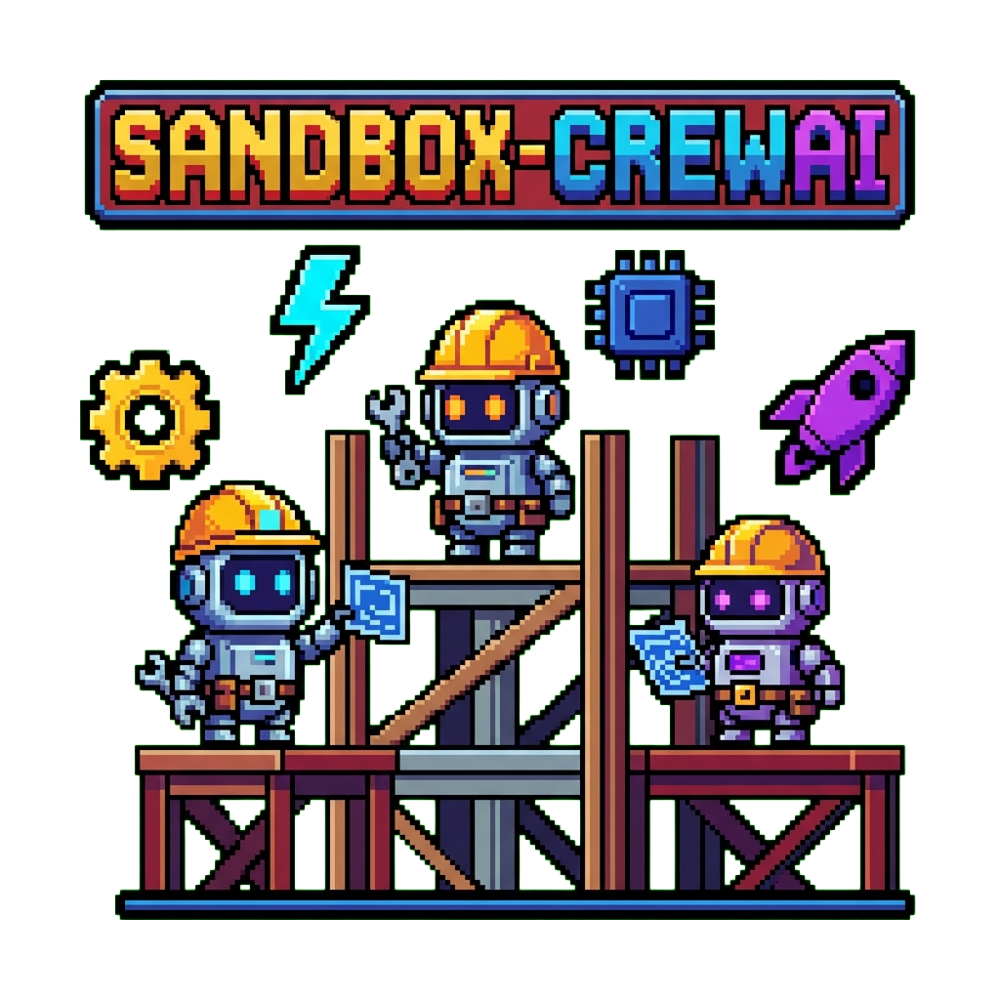
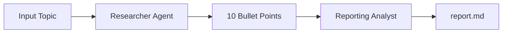

<div align="center">
  

  # sandbox-crewai

  [](https://www.python.org/)
  [](https://docs.crewai.com/)
  [](LICENSE)
  [](environment.yml)

  **A sandbox for experimenting with CrewAI multi-agent AI systems that research topics and generate comprehensive reports**

  [CrewAI Docs](https://docs.crewai.com/) · [Agents Guide](https://docs.crewai.com/concepts/agents) · [Tasks Guide](https://docs.crewai.com/concepts/tasks)
</div>

## Overview

This project provides a ready-to-use sandbox for exploring the CrewAI framework. It includes a sample crew implementation called `latest_ai_development` that demonstrates a two-agent research and reporting workflow:

- **Researcher Agent** - Discovers cutting-edge developments on any topic
- **Reporting Analyst Agent** - Transforms research into detailed, structured reports

## Features

- **Decorator-based architecture** - Clean `@agent`, `@task`, and `@crew` decorators for defining crews
- **YAML configuration** - Externalized agent and task definitions for easy customization
- **Template variables** - Dynamic `{topic}` interpolation across all configurations
- **Sequential processing** - Tasks execute in order with output chaining
- **Markdown output** - Reports generated as formatted `report.md` files

## Quick Start

```bash
# Clone and setup
git clone https://github.com/tsilva/sandbox-crewai.git
cd sandbox-crewai
conda env create -f environment.yml
conda activate crewai-sandbox

# Configure API key
cp .env.example .env
# Edit .env and add your OPENAI_API_KEY

# Run the crew
python main.py
```

## Installation

### Prerequisites

- [Conda](https://docs.conda.io/en/latest/miniconda.html) or [Mamba](https://mamba.readthedocs.io/)
- OpenAI API key

### Environment Setup

```bash
# Create the conda environment
conda env create -f environment.yml

# Activate it
conda activate crewai-sandbox
```

### Configuration

Create a `.env` file in the project root:

```bash
OPENAI_API_KEY=your-api-key-here
```

## Usage

### Run the Crew

```bash
# From project root
python main.py
```

This runs the default topic "AI Agents". To research a different topic, edit `main.py`:

```python
inputs = {
    'topic': 'Your Topic Here'
}
```

### Alternative Entry Points

```bash
# Using the crew's CLI entry point
cd latest_ai_development
run_crew

# Train the crew
train <n_iterations> <filename>

# Test the crew
test <n_iterations> <openai_model_name>

# Replay a specific task
replay <task_id>
```

## Architecture

```
sandbox-crewai/
├── main.py                          # Main entry point
├── environment.yml                  # Conda environment definition
├── .env.example                     # Environment template
└── latest_ai_development/
    └── src/latest_ai_development/
        ├── crew.py                  # Crew definition with decorators
        ├── main.py                  # CLI entry points
        ├── config/
        │   ├── agents.yaml          # Agent definitions
        │   └── tasks.yaml           # Task definitions
        └── tools/
            └── custom_tool.py       # Custom tools (extensible)
```

### Crew Flow



### Agent Configuration

Agents are defined in `config/agents.yaml`:

| Agent | Role | Output |
|-------|------|--------|
| Researcher | `{topic}` Senior Data Researcher | 10 bullet points of findings |
| Reporting Analyst | `{topic}` Reporting Analyst | Full markdown report |

### Task Configuration

Tasks are defined in `config/tasks.yaml`:

| Task | Description | Agent |
|------|-------------|-------|
| research_task | Conduct thorough research on `{topic}` | Researcher |
| reporting_task | Expand findings into detailed report sections | Reporting Analyst |

## Customization

### Adding New Agents

1. Add agent definition to `config/agents.yaml`:
```yaml
new_agent:
  role: >
    {topic} Expert Role
  goal: >
    Your agent's goal
  backstory: >
    Agent background story
```

2. Register in `crew.py`:
```python
@agent
def new_agent(self) -> Agent:
    return Agent(
        config=self.agents_config['new_agent'],
        verbose=True
    )
```

### Adding New Tasks

1. Add task definition to `config/tasks.yaml`:
```yaml
new_task:
  description: >
    Task description with {topic} variable
  expected_output: >
    What the task should produce
  agent: new_agent
```

2. Register in `crew.py`:
```python
@task
def new_task(self) -> Task:
    return Task(
        config=self.tasks_config['new_task'],
    )
```

### Adding Custom Tools

Create tools in `tools/custom_tool.py` and attach to agents:

```python
from crewai.tools import tool

@tool
def my_custom_tool(input: str) -> str:
    """Tool description for the agent."""
    return f"Processed: {input}"
```

## Dependencies

| Package | Purpose |
|---------|---------|
| `crewai` | Multi-agent orchestration framework |
| `crewai[tools]` | Built-in tools for agents |
| `crewai[embeddings]` | Embedding support |
| `python-dotenv` | Environment variable management |

## Contributing

1. Fork the repository
2. Create a feature branch (`git checkout -b feature/amazing-feature`)
3. Commit your changes (`git commit -m 'Add amazing feature'`)
4. Push to the branch (`git push origin feature/amazing-feature`)
5. Open a Pull Request

## License

This project is available under the MIT License.

## Resources

- [CrewAI Documentation](https://docs.crewai.com/)
- [CrewAI GitHub](https://github.com/crewAIInc/crewAI)
- [Agents Concept](https://docs.crewai.com/concepts/agents)
- [Tasks Concept](https://docs.crewai.com/concepts/tasks)
- [Crews Concept](https://docs.crewai.com/concepts/crews)
